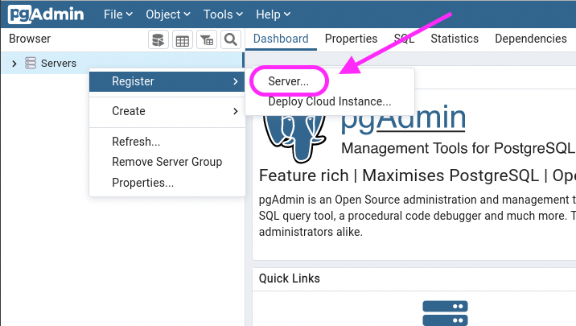
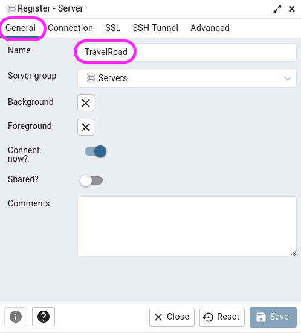
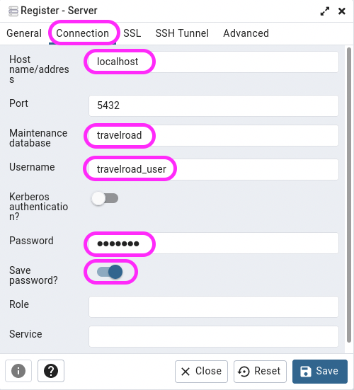
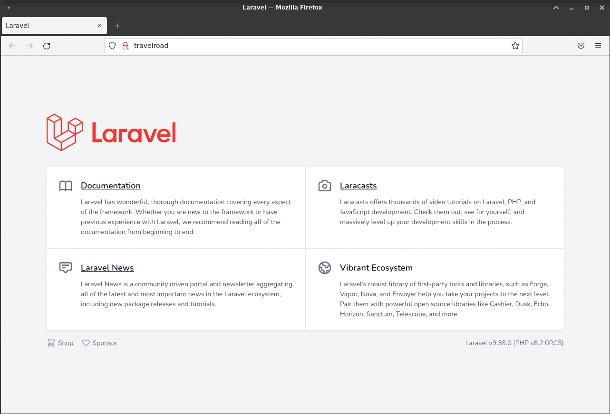
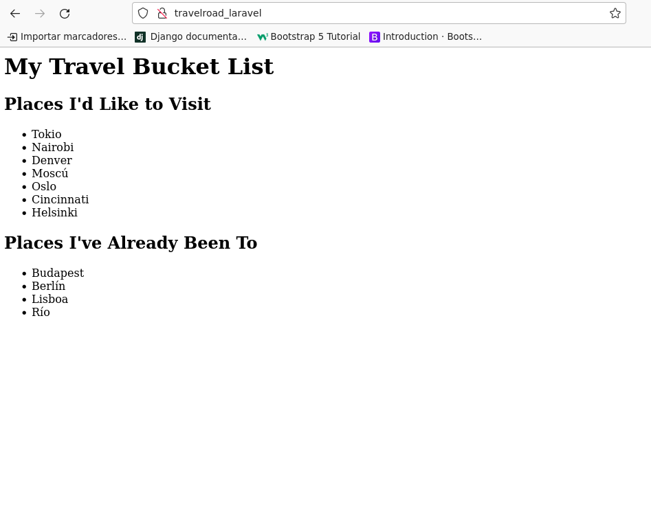
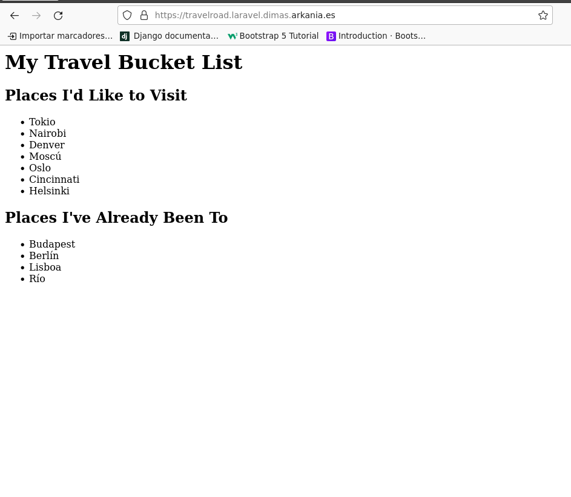

<center>

# TÍTULO DE LA PRÁCTICA


</center>

***Nombre:***
***Curso:*** 2º de Ciclo Superior de Desarrollo de Aplicaciones Web.

### ÍNDICE

+ [Introducción](#id1)
+ [Objetivos](#id2)
+ [Material empleado](#id3)
+ [Desarrollo](#id4)
+ [Conclusiones](#id5)


#### ***Introducción***. <a name="id1"></a>


#### ***Objetivos***. <a name="id2"></a>

Esta práctica tiene como objetivo desplegar un proyecto con el framework para php, Laravel, dentro de un servidor web nginx y una base de datos postgreSQL.

#### ***Material empleado***. <a name="id3"></a>

Para la realización de esta práctica se ha utilizado una máquina virtual Debian12 como máquina de desarrollo y otra Debian12 en una VPS de Azure como máquina de producción. 

#### ***Desarrollo***. <a name="id4"></a>

##### Entorno de Desarrolo Laravel(PHP)

###### PostrgreSQL

El resultado final de esta práctica será mostrar serie de datos que se encuentran en una base de datos en PostgreSQL.

Para ello en primer lugar se debe de instalar PostegreSQL

```
sudo apt update
```

Instalamos una serie de paquetes de soporto

```
sudo apt install -y apt-transport-https
```

Seguido a esto añadimos el repositorio oficial de PostgreSQL

```
echo "deb http://apt.postgresql.org/pub/repos/apt/ $(lsb_release -cs)-pgdg main" \
| sudo tee /etc/apt/sources.list.d/postgresql.list > /dev/null
```

Una vez hecho esto es necesario volver a actualizar los paquetes

```
sudo apt update
```

E instalamos la versión correspondiente, en nuestro caso, la 15

```
sudo apt install -y postgresql-15
```

Hay que tenr en cuenta que PostgreSQL una vez instalado el servicio se iniciará de manera automática y el puerto de este será por defecto el 5432.

Instalado PostgreSQL el siguiente paso será crear la base de datos con la que vamos a trabajar así como el usuario y contraseña propietarios de la misma

```
sudo -u postgres psql 
psql (16.1 (Debian 16.1-1.pgdg120+1))
Digite «help» para obtener ayuda.

postgres=# CREATE USER travelroad_user WITH PASSWORD 'XXXXXXXX';
CREATE ROLE
postgres=# CREATE DATABASE travelroad WITH OWNER travelroad_user;
CREATE DATABASE
```

Hecho esto, podemos acceder a la base de datos creada para crear las tablas correspondiente e introducir los datos que vamos a usar posteriormente en el proyecto

Para entrar a la base de datos que hemos creado anteriormente bastará con usar el siguiente comando: 
```
psql -h localhost -U travelroad_user travelroad
```
Una vez dentro crearemos la tabla "places" de la siguiente manera: 
```
travelroad=> CREATE TABLE places(
id SERIAL PRIMARY KEY,
name VARCHAR(255),
visited BOOLEAN);
CREATE TABLE
```

Por último, para introducir datos en la misma usaremos un csv 

```
curl -o /tmp/places.csv https://raw.githubusercontent.com/sdelquin/dpl/main/ut4/files/places.csv
```

Y usamos la función copy de PostgreSQL para insertar los datos del csv en la tabla

```
 psql -h localhost -U travelroad_user -d travelroad \
-c "\copy places(name, visited) FROM '/tmp/places.csv' DELIMITER ','"
```

La siguiente parte de la configuración de la base de datos sería la implementación de pgAdmin, que es, grosso modo, una interfaz gráfica para PostgreSQL

Ya que pgAdmin está desarrollado en flask (un framework para backend de python), será necesario tener python instalado y dado que Python instala ciertas herramientas ejecutables en línea de comandos, es necesario aseguramos que la ruta a estos binarios está en el PATH:
```
echo 'export PATH=~/.local/bin:$PATH' >> .bashrc && source .bashrc
```

Para la instalación de pgAdmin deberamos de crear las carpetas de trabajo siguientes con sus permisos: 

```
sudo mkdir /var/lib/pgadmin
sudo mkdir /var/log/pgadmin
sudo chown $USER /var/lib/pgadmin
sudo chown $USER /var/log/pgadm
```

Creada las carpetas el siguiente paso será crear un entorno virtual donde instalar pgAdmin

```
python -m venv pgadmin4
source pgadmin4/bin/activate
(pgadmin4) pc17-dpl@a109pc17dpl:~/pgadmin4$pip install pgadmin4
```
Para mantener activo pgAdmin utilizaremos gunicorn. Para ello será necesario instalar el mismo en el entorno virtual

```
gunicorn \
--chdir pgadmin4/lib/python3.11/site-packages/pgadmin4 \
--bind unix:/tmp/pgadmin4.sock pgAdmin4:app
```

Y configuramos el virtual host en Nginx

```
sudo vi /etc/nginx/conf.d/pgadmin.conf
```

```
server {
    server_name pgadmin.arkania.es;

    location / {
        proxy_pass http://unix:/tmp/pgadmin4.sock;  # socket UNIX
    }
}
```

Demonizaremos el servicio para mantener el proceso gunicorn activo

```
sudo vi /etc/systemd/system/pgadmin.service
```

```
[Unit]
Description=pgAdmin

[Service]
User=sdelquin
ExecStart=/bin/bash -c '\
source /home/sdelquin/pgadmin4/bin/activate && \
gunicorn --chdir /home/sdelquin/pgadmin4/lib/python3.11/site-packages/pgadmin4 \
--bind unix:/tmp/pgadmin4.sock \
pgAdmin4:app'
Restart=always

[Install]
WantedBy=multi-user.target
```

Hecho esto recagarmos los servicios para luego levantar pgAdmin y habilitarlo en caso de reinicio del sistema

```
sudo systemctl daemon-reload
sudo systemctl start pgadmin
sudo systemctl enable pgadmin
```

Para registrar un servidor seguiremos los siguientes pasos:

<center>

<br>



<br>



<br>



<br>

</center>

Para terminar daremos acceso extero a PostgresSQL. El primero paso para esto será "escuchar" en cualquier IP. La configuración ser hará en el siguiente fichero: 

```
sudo nano /etc/postgresql/15/main/postgresql.conf
```

Y añadimos en la linéa 64 aproximadamente: 

```
listen_addresses = '*'
```

Añadimos el permiso para acceder desde el usuario travelroad_user a la base de datos travelroad desde cualquier IP:

```
sudo nano /etc/postgresql/15/main/pg_hba.conf
```

Al final de fichero añadimos: 

```
host travelroad travelroad_user 0.0.0.0/0 md5
```

###### Laravel

Para agilizar la realización de esta práctica crearemos un repositorio en Github donde alojaremos todo el proyecto. Una vez creado lo clonaremos en la máquina de desarrollo.

Hecho esto, la instalación de laravel comenzará con la instalación del gestor de dependicas para PHP, Composer.

```
curl -fsSL https://raw.githubusercontent.com/composer/getcomposer.org/main/web/installer \
| php -- --quiet | sudo mv composer.phar /usr/local/bin/composer
```

El comando anterior descargará composer.phar desde el repositorio del proyecto y lo moverá a la carpeta /usr/local/bin con el nombre de "composer" para poder utilizarlo globlamnete.

Configurado Composer instalaremos los modulos necesarios de PHP

```
sudo apt install -y php8.2-mbstring php8.2-xml \
php8.2-bcmath php8.2-curl php8.2-pgsql
```

El paso siguiente será la creación del propio proyecto. A este le daremos el nombre de travelroad_laravel y, en nuestro caso, lo alojaremos en la ruta "/usr/share/nginx" debido a una cuestión de permisos.

```
composer create-project laravel/laravel travelroad_laravel
```

Creado el proyecto deberemos de modificar el fichero de configuración dejandolo de la siguiente manera: 

```
...
APP_NAME=TravelRoad
APP_ENV=development
...
DB_CONNECTION=pgsql
DB_HOST=127.0.0.1
DB_PORT=5432
DB_DATABASE=travelroad
DB_USERNAME=travelroad_user
DB_PASSWORD=XXXXXXX
...
```

A continuación configuraremos los permisos adecuados a los ficheros del proyecto para quelos servicios tanto de Nginx como de PHP-FPM puedan trabajar:

```
pc17-dpl@a109pc17dpl:~/travelroad$ sudo chgrp -R nginx storage bootstrap/cache
pc17-dpl@a109pc17dpl:~/travelroad$ sudo chmod -R ug+rwx storage bootstrap/cac
```

En cuanto a la configuración de Nginx lo único que queda es configurar el virtual host

```
sudo nano /etc/nginx/conf.d/travelroad_laravel.conf
```
```
server {
    server_name travelroad_laravel;
    root /usr/share/nginx/travelroad_laravel/public;

    index index.html index.htm index.php;

    location / {
        try_files $uri $uri/ /index.php?$query_string;
    }

    location ~ \.php$ {
        fastcgi_pass unix:/var/run/php/php8.2-fpm.sock;
        fastcgi_param SCRIPT_FILENAME $realpath_root$fastcgi_script_name;
        include fastcgi_params;
    }
}
```

Reniciamos nginx para que aplique los cambios

```
sudo systemctl reload nginx
```

<center>



</center>

Ya solo queda utilizar los datos que se encuentran en nuestra base de datos para poder mostrar la información. Para ello crearemos el fichero .php con la lógica de negocio de nuestra aplicación

```
pc17-dpl@a109pc17dpl:~/travelroad$ nano routes/web.php
```

Y por último creamos la plantilla con el motor de plantillas Blade

```
pc17-dpl@a109pc17dpl:~/travelroad$ nano resources/views/travelroad.blade.php
```

```
<html>
  <head>
    <title>Travel List</title>
  </head>

  <body>
    <h1>My Travel Bucket List</h1>
    <h2>Places I'd Like to Visit</h2>
    <ul>
      @foreach ($wished as $place)
      <li>{{ $place->name }}</li>
      @endforeach
    </ul>

    <h2>Places I've Already Been To</h2>
    <ul>
      @foreach ($visited as $place)
      <li>{{ $place->name }}</li>
      @endforeach
    </ul>
  </body>
</html>
```

<center>



</center>

Por último crearemos un script que sirva para actualizar los cambios en producción.

```
pc17-dpl@a109pc17dpl:~/travelroad$  nano deploy.sh
```

Y añadimos el siguiente código bash

```
#!/bin/bash

cd /home/pc17-dpl/travelroad_laravel
git add .
git commit -m "Changes done"
git push

ssh dimas@dimas.arkania.es "
  cd /home/dimas/travelroad_laravel
  git pull
  composer install
"
```

y damos permisos de ejecución:

```
pc17-dpl@a109pc17dpl:~/travelroad$ chmod +x deploy.sh
```


##### Entorno de Producción Laravel(PHP)

###### Laravel

En primer lugar en este caso deberemos de clonar el repositorio creado previamente en la máquina de desarrolo en la máquina de producción.

Hecho esto deberemos de crear nuevamente el .env así como también utilizar el comando "composer install" para crear la carpeta "ventor" y descargar las dependencias que se alojarán en esta.

Por otro lado será necesario volver a crear los ficheros de configuración del proyecto en nginx, puediendo darle en este caso la ruta siguiente:

```
/home/dimas/travelroad_laravel/public
```

Además de un nombre de dominio propio, en nuestro caso:
```
travelroad.laravel.dimas.arknia.es
```

<center>



</center>

Para finalizar se podrá usar certbot para generar los certificados necesarios

```
certbot --nginx
```
##### Modificación del proyecto

Para modificar este proyecto ha sido necesario configurar el fichero de web.php donde se gestionan las rutas
```
<?php

// https://laravel.com/api/6.x/Illuminate/Support/Facades/DB.html
use Illuminate\Support\Facades\DB;

Route::get('/', function () {
  $wished = DB::select('select * from places where visited = false');
  $visited = DB::select('select * from places where visited = true');

  return view('travelroad', ['wished' => $wished, 'visited' => $visited]);
});

Route::get('/visited', function () {
	$visited = DB::select('select * from places where visited = true');
	return view('visited', ['visited' => $visited]);
});

Route::get('/wished', function () {
	$wished = DB::select('select * from places where visited = false');
	return view('wished', ['wished' => $wished]);
});
```
Esto nos permitirá definir las rutas y las variables que se pasarán a las vistas. Así pues, el último paso sería definir las nuevas vistas:

- Visited:

```
<html>
	<head>
		<title>Visited Places List</title>
	</head>
	<body>
		<h1>Places I've Already Been To</h1>
		<ul>
		@foreach ($visited as $place)
		<li>{{ $place->name }}</li>
		@endforeach
		</ul>
		<a href='/'>&lt;-Back home</a>
	</body>
</html>
```

- Wished:

```
<html>
	<head>
		<title>Wished Places List</title>
	</head>
	<body>
		<h1>Places I'd Like to Visit</h1>
		<ul>
		@foreach ($wished as $place)
		<li>{{ $place->name }}</li>
		@endforeach
		</ul>
		<a href='/'>&lt;-Back home</a>
	</body>
</html>
```

- Index:

```
<html>
 	<head>
    <title>Travel List</title>
  	</head>
  	<body>
    	<h1>My Travel Bucket List</h1>
		<a href="/visited">Places I've Already Been To</a>
		<br>
		<a href="/wished">Places I'd Like to Visit</a>
		<p>Powered by Laravel &#128171; Test clase</p>
	</body>
</html>
```

PD: El ejecutable deploy.sh nos permite que una vez creado cambios en la máquina de desarrollo se suban los cambios direcatemente al gestor de proyectos Github y se bajen los cambios en el servidor de Producción.
#### ***Conclusiones***. <a name="id5"></a>

En esta práctica hemos aprenido a como desplegar un proyecto Laravel con PostgreSQL como base con nginx como servidor web.
La mayor dificultad de este proceso ha sido sin duda los permisos requeridos por Nginx y el servidor de aplicaciones PHP-FPM. No osbtante esto ha sido solucionado moviendo el proyecto a la carpeta /usr/share/nginx.
Sin lugar a dudas lo más interesante, quitante el despliegue, ha sido la creación del script que permite realizar los push y commits automáticamente asi como los pulls en el servidor de producción.
